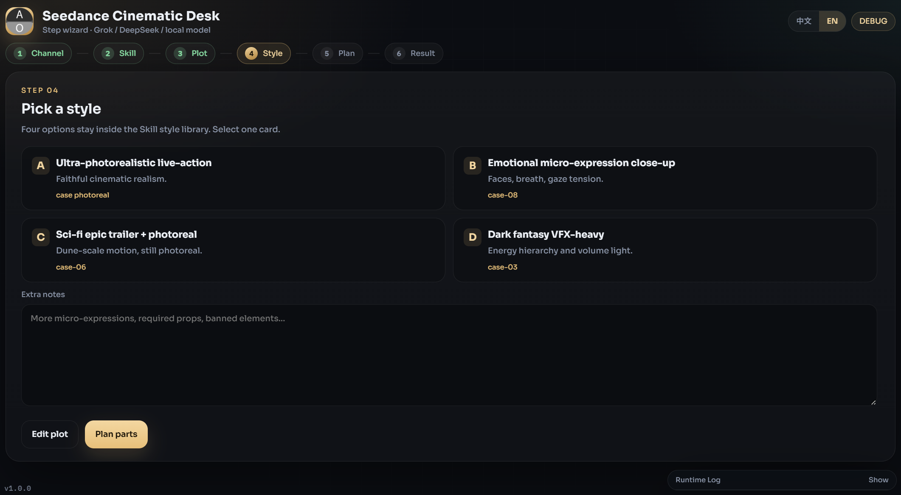

<div align="center">

# Seedance Cinematic Desk

**Packed via Axiox Media**

Local step-wizard that turns a plot into ultra-detailed Seedance 2.0 cinematic prompts via Grok, DeepSeek, or an offline GGUF model.

<p>
  <a href="docs/README-zh.md"></a>
</p>

<p>
  <a href="#install">Install</a> ·
  <a href="#features">Features</a> ·
  <a href="#requirements">Requirements</a> ·
  <a href="#architecture">Architecture</a> ·
  <a href="#documentation">FAQ</a>
</p>

<p>
  
  
  
  
</p>

</div>

<div align="center">
  
</div>

## Install

Install and launch with [GitHub Deploy Desk](https://github.com/axioxmedia/github-deployer). Paste this repository URL, confirm the README, then deploy.

To run from source after the folder is on disk:

```bat
python -m venv .venv
.venv\Scripts\python.exe -m pip install -r requirements.txt
.venv\Scripts\python.exe app.py
```

Or double-click `start.bat`.

### Windows EXE

1. Install Python 3.11 or 3.12 and check **Add python.exe to PATH**.
2. Double-click `build_exe.bat` (or `powershell -ExecutionPolicy Bypass -File .\build_exe.ps1`).
3. Result: `dist\SeedanceCinematicDesk.exe`.

Local models (`llama-cpp-python`) are optional and installed only when you choose the local engine.

## Features

- Six isolated wizard cards. Next hides the previous card.
- Grok (`grok-4.6`), DeepSeek, or local GGUF via llama.cpp worker process.
- Skill ZIP parse (`SKILL.md` + reference markdown).
- Style cards, part planning, per-part generation, save under `output/`.
- VRAM probe + 7B / 14B / 32B catalog with force-download confirm.
- Runtime log SSE dock. zh / EN chrome, remembered in `localStorage.aio.uiLang`.

## Requirements

- Windows 10/11, Python 3.11+
- Cloud keys for Grok or DeepSeek when not using a local model
- Optional NVIDIA GPU + `llama-cpp-python` for offline inference
- Disk space for Q4_K_M GGUF files (several GB)

## Architecture

FastAPI on `127.0.0.1` (port from 8787) + pywebview desktop window.

| Route | Job |
|---|---|
| `POST /api/ai/complete` | Provider gateway (Grok / DeepSeek / local) |
| `POST /v1/chat/completions` | Same body, OpenAI-shaped alias |
| `GET /api/models` | Catalog + VRAM + load status |
| `POST /api/models/download` | Hugging Face snapshot into `models/<id>/` |
| `POST /api/skill/parse` | Skill ZIP → markdown |
| `POST /api/save_part` | Write `output/<project>/PartN.txt` |
| `GET /api/logs/stream` | Runtime log SSE |
| `GET /api/defaults` | Version + data root |

Modules wired: `webview-app-shell`, `ai-provider-gateway`, `ai-writing-assist`.

## Documentation

- Logs next to the EXE: `seedance_desk.log`
- Models next to the EXE: `models/`
- Generated parts: `output/`
